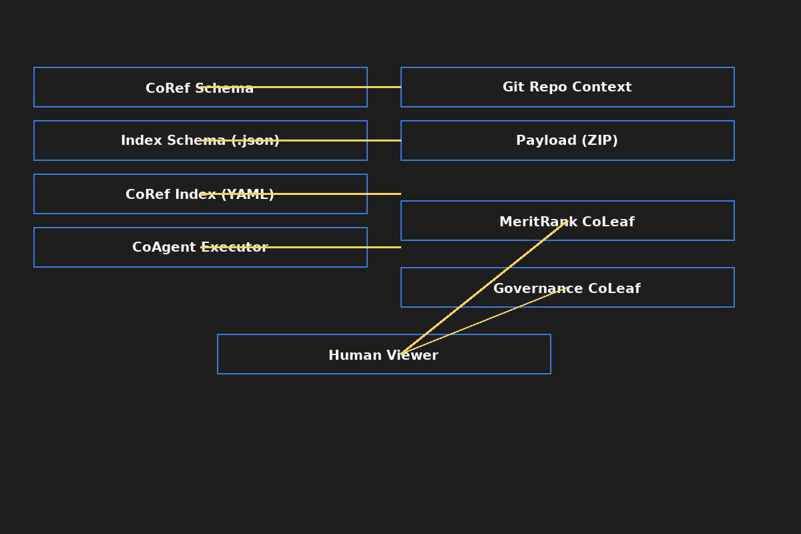

# CoRef: Concept-Reference Protocol

Track the co-evolution of ideas, intent, and implementation across agents and time.

 ## 🧩 CoRef Interop Stack Diagram  This diagram visualizes the layered interop stack of the CoRef indexing system, including:  - **Canonical CoRef Index** - **Human/AI Friendly Index Layers** - **Tag Variants & Aliases** - **CoRef-Compatible Interop Modules**  
